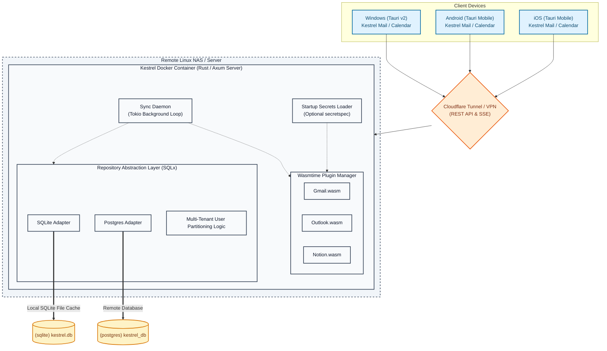

# Kestrel: Technical Specification

**Version:** 1.0  
**Authors:** AI Coding Assistant & Developer  
**Status:** Approved / Ready for Implementation  

---

## 1. Executive Summary

**Kestrel** is a private, lightweight, self-hosted email and calendar client designed to provide a high-end, keyboard-driven user interface (inspired by Superhuman and Notion Mail) while running with a minimal resource footprint on Windows, Android, and iOS.

The architecture is split into a **Rust-based Server (Backend)** running in Docker on a remote Linux NAS and two separate native **Svelte/Tauri Client apps** — **Kestrel Mail** and **Kestrel Calendar** — running natively on client devices. Communication is secured either over a Cloudflare Tunnel (public deployment) or a Tailscale VPN (private deployment); both are supported — the choice is made by the administrator at setup time by configuring `KESTREL_BASE_URL`. Each Tauri app maintains its own independent auth session — the user logs into each app separately with their username and password.

To support both lightweight file-based caches and robust multi-user enterprise servers, the database layer supports both **SQLite** and **PostgreSQL** backends. This is achieved via a compile-time verified Repository Abstraction layer using SQLx, avoiding the runtime performance penalties of an ORM.

Additionally, to enable unlimited extensibility without modifying the core system, the backend employs a sandboxed **Server-side WebAssembly (WASM) Plugin Architecture** to dynamically support third-party mail providers (e.g. Gmail, Yahoo, Hotmail, custom IMAP) and calendar synchronization sources (e.g. Google Calendar, Outlook Calendar, Notion Databases).

Finally, Kestrel integrates an optional **Startup Secrets Manager (`secretspec`)** loader. When deployed in secure environments, Kestrel retrieves sensitive keys (such as OAuth keys, FCM keys, and session salts) from secret vaults at startup, falling back to standard plaintext environment variables for simple deployments.

External credentials and sync configurations are maintained in a **Centralized Token Vault** on the server, partitioned logically using a rudimentary **Logical Multi-Tenancy** structure. Once a user registers and pairs their client device with the daemon, any mail or calendar accounts they authorize are associated directly with their user record. Separate user spaces are strictly isolated: composite unique indices permit multiple users to pair the same mailbox address independently, ensuring distinct authentication keys and cached records never overlap or leak.



---

## 2. Core Architecture

### 2.1 Backend Server (Kestrel Daemon)

* **Host Platform:** Remote Linux NAS or cloud server (Docker Compose).
* **Programming Language:** **Rust** (compiled native binary).
* **Web Framework:** `axum` with `tokio` async runtime.
* **Database Engine:** Dynamic selection of **SQLite** (file-based) or **PostgreSQL** (remote database) depending on configuration.
* **Database Adapter:** Compile-time verified query repositories using **SQLx** implementing trait boundaries.
* **Plugin Engine:** **Wasmtime** (compiled dynamic loader running `.wasm` packages compiled to `wasm32-wasi` targets).
* **Secrets Engine:** Optional **Startup Secrets Loader (`secretspec`)** resolving credentials at container launch.
* **API Integrations:** Extracted completely into isolated WASM plugins that communicate with the host daemon via standard WebAssembly Interface Types (WIT).

### 2.2 Frontend Clients (Kestrel UI)

* **UI Framework:** **Svelte** (highly reactive, compiles to native-speed minimalist JS with zero runtime framework bloat).
* **CSS Styling:** **TailwindCSS** (utility-first styling).
* **Component Library:** **Skeleton UI** (Svelte-native components using the custom **Kestrel Slate** dark-mode theme).
* **Desktop Wrapper:** **Tauri v2** (native Windows executable using system WebView2, keeping RAM < 40MB).
* **Mobile Wrapper:** **Tauri Mobile v2** (compiles the same Svelte code to native Android `.apk` and iOS `.ipa` packages).

---

## 3. Database Schema & Dual Backends

To achieve cross-compatibility, Kestrel's core specifies trait boundaries (e.g. `MessageRepository`, `EventRepository`). The implementation utilizes database-specific packages to execute native dialects (for example, SQLite's FTS5 engine vs. Postgres's `tsvector` system). Both adapters support logical partitioning via the `users` relational boundary, with composite unique constraints protecting shared mailbox bindings.

### 3.1 SQLite Core Tables

```sql
-- SQLite Users Table
CREATE TABLE users (
    id TEXT PRIMARY KEY,
    username TEXT UNIQUE NOT NULL,
    password_hash TEXT NOT NULL,
    created_at INTEGER NOT NULL
);

-- SQLite Core Accounts (Composite unique constraint allows different users to add identical mail address)
CREATE TABLE accounts (
    id TEXT PRIMARY KEY,
    user_id TEXT NOT NULL,
    provider TEXT NOT NULL,
    email_address TEXT NOT NULL,
    access_token TEXT NOT NULL,
    refresh_token TEXT NOT NULL,
    token_expiry INTEGER NOT NULL,
    FOREIGN KEY(user_id) REFERENCES users(id) ON DELETE CASCADE,
    UNIQUE(user_id, email_address)
);

-- SQLite Cached Email Messages
CREATE TABLE messages (
    id TEXT PRIMARY KEY,
    account_id TEXT NOT NULL,
    external_id TEXT NOT NULL,
    thread_id TEXT NOT NULL,
    subject TEXT,
    sender_name TEXT,
    sender_email TEXT NOT NULL,
    recipients TEXT NOT NULL,        -- JSON array
    date_sent INTEGER NOT NULL,
    date_received INTEGER NOT NULL,
    snippet TEXT,
    body_text TEXT,                  -- NULL until fetched on-demand
    body_html TEXT,                  -- NULL until fetched on-demand
    labels TEXT,                     -- JSON array of provider-native label strings
    is_read INTEGER DEFAULT 0,
    is_starred INTEGER DEFAULT 0,    -- starred/flagged messages have body pre-cached
    is_archived INTEGER DEFAULT 0,
    is_deleted INTEGER DEFAULT 0,    -- soft delete flag
    FOREIGN KEY(account_id) REFERENCES accounts(id) ON DELETE CASCADE
);

-- SQLite Cached Calendars
CREATE TABLE calendars (
    id TEXT PRIMARY KEY,
    account_id TEXT NOT NULL,
    external_id TEXT NOT NULL,
    name TEXT NOT NULL,
    color TEXT,
    is_primary INTEGER DEFAULT 0,
    is_selected INTEGER DEFAULT 1,
    FOREIGN KEY(account_id) REFERENCES accounts(id) ON DELETE CASCADE
);

-- SQLite Cached Calendar Events
CREATE TABLE calendar_events (
    id TEXT PRIMARY KEY,
    calendar_id TEXT NOT NULL,
    external_id TEXT NOT NULL,
    title TEXT NOT NULL,
    description TEXT,
    location TEXT,
    start_time INTEGER NOT NULL,
    end_time INTEGER NOT NULL,
    is_all_day INTEGER DEFAULT 0,
    recurrence_rules TEXT,
    organizer_name TEXT,
    organizer_email TEXT,
    attendees TEXT,
    status TEXT DEFAULT 'confirmed',
    updated_at INTEGER NOT NULL,
    FOREIGN KEY(calendar_id) REFERENCES calendars(id) ON DELETE CASCADE
);

-- SQLite Conflict Resolution Backup History
CREATE TABLE historical_revisions (
    id INTEGER PRIMARY KEY AUTOINCREMENT,
    resource_type TEXT NOT NULL,
    resource_id TEXT NOT NULL,
    serialized_payload TEXT NOT NULL,
    overwritten_at INTEGER NOT NULL
);
```
-- SQLite Offline Mutation Queue
-- Persisted in local app-data dir (kestrel_queue.db), NOT on the server.
-- Records pending mutations to replay when connectivity is restored.
CREATE TABLE offline_queue (
    id INTEGER PRIMARY KEY AUTOINCREMENT,
    action TEXT NOT NULL,            -- 'archive' | 'trash' | 'mark_read' | 'send_mail' | 'create_event' | 'update_event' | 'delete_event'
    resource_type TEXT NOT NULL,     -- 'message' | 'event'
    resource_id TEXT NOT NULL,
    payload TEXT,                    -- JSON payload for mutations that need it (e.g. compose body)
    queued_at INTEGER NOT NULL,
    retry_count INTEGER DEFAULT 0
);

### 3.2 PostgreSQL Equivalent Schema

```sql
-- Postgres Users Table
CREATE TABLE users (
    id VARCHAR(36) PRIMARY KEY,
    username VARCHAR(255) UNIQUE NOT NULL,
    password_hash TEXT NOT NULL,
    created_at BIGINT NOT NULL
);

-- Postgres Core Accounts (Composite unique constraint allows different users to add identical mail address)
CREATE TABLE accounts (
    id VARCHAR(36) PRIMARY KEY,
    user_id VARCHAR(36) NOT NULL REFERENCES users(id) ON DELETE CASCADE,
    provider VARCHAR(50) NOT NULL,
    email_address VARCHAR(255) NOT NULL,
    access_token TEXT NOT NULL,
    refresh_token TEXT NOT NULL,
    token_expiry BIGINT NOT NULL,
    CONSTRAINT unique_user_email UNIQUE(user_id, email_address)
);

-- Postgres Cached Email Messages
CREATE TABLE messages (
    id VARCHAR(36) PRIMARY KEY,
    account_id VARCHAR(36) NOT NULL REFERENCES accounts(id) ON DELETE CASCADE,
    external_id VARCHAR(255) NOT NULL,
    thread_id VARCHAR(255) NOT NULL,
    subject TEXT,
    sender_name TEXT,
    sender_email VARCHAR(255) NOT NULL,
    recipients TEXT NOT NULL,          -- JSON array
    date_sent BIGINT NOT NULL,
    date_received BIGINT NOT NULL,
    snippet TEXT,
    body_text TEXT,                    -- NULL until fetched on-demand
    body_html TEXT,                    -- NULL until fetched on-demand
    labels TEXT,                       -- JSON array of provider-native label strings
    is_read BOOLEAN DEFAULT FALSE,
    is_starred BOOLEAN DEFAULT FALSE,  -- starred/flagged messages have body pre-cached
    is_archived BOOLEAN DEFAULT FALSE,
    is_deleted BOOLEAN DEFAULT FALSE   -- soft delete flag
);

-- Postgres Cached Calendars
CREATE TABLE calendars (
    id VARCHAR(36) PRIMARY KEY,
    account_id VARCHAR(36) NOT NULL REFERENCES calendars(id) ON DELETE CASCADE,
    external_id VARCHAR(255) NOT NULL,
    name VARCHAR(255) NOT NULL,
    color VARCHAR(7),
    is_primary BOOLEAN DEFAULT FALSE,
    is_selected BOOLEAN DEFAULT TRUE
);

-- Postgres Cached Calendar Events
CREATE TABLE calendar_events (
    id VARCHAR(36) PRIMARY KEY,
    calendar_id VARCHAR(36) NOT NULL REFERENCES calendars(id) ON DELETE CASCADE,
    external_id VARCHAR(255) NOT NULL,
    title VARCHAR(255) NOT NULL,
    description TEXT,
    location TEXT,
    start_time BIGINT NOT NULL,
    end_time BIGINT NOT NULL,
    is_all_day BOOLEAN DEFAULT FALSE,
    recurrence_rules TEXT,
    organizer_name VARCHAR(255),
    organizer_email VARCHAR(255),
    attendees TEXT, -- JSON formatted array
    status VARCHAR(50) DEFAULT 'confirmed',
    updated_at BIGINT NOT NULL
);

-- Postgres Conflict Resolution Backup History
CREATE TABLE historical_revisions (
    id SERIAL PRIMARY KEY,
    resource_type VARCHAR(20) NOT NULL,
    resource_id VARCHAR(36) NOT NULL,
    serialized_payload TEXT NOT NULL,
    overwritten_at BIGINT NOT NULL
);
```

---

## 4. API Endpoints (Axum Server)

Client devices query the Axum server over the public/private URL.

| Method | Endpoint | Description | Payload / Response |
| --- | --- | --- | --- |
| **POST** | `/api/auth/register` | Registers a new user | `{ "username": "...", "password": "..." }` |
| **POST** | `/api/auth/token` | Username+password login; returns bearer token | `{ "username": "...", "password": "..." }` → `{ "token": "..." }` |
| **GET** | `/api/auth/login?provider=x` | Initiates OAuth flow for provider account connection | Redirect to provider consent screen |
| **GET** | `/api/auth/callback` | OAuth redirect landing; stores token; redirects to `kestrel://` deep link | Redirect response |
| **GET** | `/api/messages` | Paginated thread headers + snippets (no body) | `?account_id=&cursor=&limit=50&folder=inbox` |
| **GET** | `/api/messages/:id` | Full message body (fetched on-demand) | JSON payload |
| **POST** | `/api/messages/:id/archive` | Archive message locally + queue upstream sync | Empty |
| **POST** | `/api/messages/:id/read` | Mark read/unread locally + queue upstream sync | `?status=true/false` |
| **POST** | `/api/messages/:id/trash` | Soft-delete locally; plugin syncs deletion upstream | Empty |
| **GET** | `/api/search` | FTS5 full-text search across message headers/snippets | `?q=term&account_id=` |
| **GET** | `/api/calendars` | All synced calendars | JSON list |
| **GET** | `/api/events` | Events within UTC timestamp range | `?start=&end=&calendar_id=` |
| **POST** | `/api/events` | Create a calendar event (with optional attendees) | JSON payload |
| **PATCH** | `/api/events/:id` | Update a calendar event | JSON payload |
| **DELETE** | `/api/events/:id` | Soft-delete event; plugin syncs upstream | Empty |
| **GET** | `/api/search/events` | FTS5 search on calendar event titles/descriptions | `?q=term` |
| **GET** | `/api/messages/:id/attachments/:filename/redirect` | Redirect to provider CDN URL for attachment download | 302 Redirect |
| **GET** | `/api/sync/stream` | SSE stream for real-time sync notifications to client | SSE stream |
| **POST** | `/api/sync/trigger` | Trigger an immediate sync cycle for the authenticated user | Empty → 202 Accepted |
| **GET** | `/api/providers` | List loaded providers with branding metadata | JSON array |
| **DELETE** | `/api/accounts/:id` | Disconnect an account — revokes tokens and wipes cached data | Empty |

> **Outbound mail** is sent directly by the Tauri client via the provider API. There is no `/api/messages/send` backend endpoint.

---

## 5. WebAssembly Plugin Specification

Kestrel plugins are compiled as WebAssembly files targeting WASI. The host daemon loads plugins dynamically and registers them as sync sources. Communication boundaries are defined by a WIT (WebAssembly Interface Types) file.

### 5.1 Host-Guest Interface (`kestrel.wit`)

```wit
interface mail-provider {
    record outbound-message {
        to: string,
        subject: string,
        body-text: string,
        body-html: option<string>,
    }

    record sync-result {
        messages: list<message-payload>,
        next-cursor: string,
    }

    record message-payload {
        id: string,
        external-id: string,
        thread-id: string,
        subject: option<string>,
        sender-name: option<string>,
        sender-email: string,
        recipients: string,
        date-sent: s64,
        date-received: s64,
        snippet: option<string>,
        labels: option<string>, // JSON array of provider-native label strings (e.g. Gmail labels, Outlook categories)
        // body-text and body-html are NOT included in sync payloads
        // Full body is fetched separately via fetch-message-body
    }

    record message-body {
        body-text: option<string>,
        body-html: option<string>,
    }

    sync-mail: func(auth-token: string, cursor: option<string>) -> result<sync-result, string>;
    fetch-message-body: func(auth-token: string, external-id: string) -> result<message-body, string>;
    delete-message: func(auth-token: string, external-id: string) -> result<_, string>;
}

interface calendar-provider {
    record calendar-payload {
        id: string,
        name: string,
        color: option<string>,
        is-primary: bool,
    }

    record event-payload {
        id: string,
        title: string,
        description: option<string>,
        location: option<string>,
        start-time: s64,
        end-time: s64,
        is-all-day: bool,
        recurrence-rules: option<string>,
    }

    fetch-calendars: func(auth-token: string) -> result<list<calendar-payload>, string>;
    fetch-events: func(auth-token: string, start-time: s64, end-time: s64) -> result<list<event-payload>, string>;
    mutate-event: func(auth-token: string, action: string, payload: event-payload) -> result<_, string>;
    delete-event: func(auth-token: string, external-id: string) -> result<_, string>;
}

interface provider-branding {
    record branding-payload {
        name: string,
        button-text: string,
        button-color: string, // hex color value, e.g. "#4285F4"
        icon-svg: string,     // raw SVG XML to embed inline in UI
    }

    get-branding: func() -> branding-payload;
}

world kestrel-plugin {
    record client-credentials {
        client-id: string,
        client-secret: string,
    }

    // Import host function allowing WASM guest to retrieve Client Credentials resolved at startup
    import get-client-credentials: func(provider: string) -> result<client-credentials, string>;

    export mail-provider;
    export calendar-provider;
    export provider-branding;
}
```

---

## 6. Environment Configurations

All system modules of the Kestrel daemon are configured using standard environment variables passed into the Docker container, or resolved dynamically from the `secretspec` configuration path at startup.

### 6.1 Environment Variables

| Variable Name | Default Value | Description |
| --- | --- | --- |
| `DATABASE_URL` | `sqlite:/app/data/kestrel.db` | Data store connection string (SQLite file path or PostgreSQL URI). |
| `PORT` | `8080` | Bind port for the Axum REST API web server. |
| `HOST` | `0.0.0.0` | Bind interface host address. |
| `KESTREL_BASE_URL` | *Required* | Public base URL of the daemon (e.g. `https://kestrel.yourdomain.com`). Used to construct OAuth redirect URIs and as the API base for client apps. |
| `RUST_LOG` | `info,kestrel=debug` | Logging level directives for the backend. |
| `SESSION_SECRET` | *Required* | Strong encryption key used to sign session tokens. |
| `PLUGINS_DIR` | `/app/plugins` | Path to load compiled WASM plugins from. |
| `SECRETSPEC_PATH` | *Optional* | Path to a `secretspec` file describing secret vault retrieval sources. |
| `GOOGLE_CLIENT_ID` | *Optional/Required* | OAuth2 client ID. Fallback if `SECRETSPEC_PATH` is not set. |
| `GOOGLE_CLIENT_SECRET` | *Optional/Required* | OAuth2 client secret. Fallback if `SECRETSPEC_PATH` is not set. |
| `MICROSOFT_CLIENT_ID` | *Optional/Required* | OAuth2 app ID. Fallback if `SECRETSPEC_PATH` is not set. |
| `MICROSOFT_CLIENT_SECRET` | *Optional/Required* | OAuth2 client secret. Fallback if `SECRETSPEC_PATH` is not set. |
| `SYNC_INTERVAL_MINUTES` | `5` | Timer interval in minutes for backend sync runner cycles. |

### 6.2 Secrets Resolution Flow (Startup-only)

1. At startup, the bootstrapper checks if `SECRETSPEC_PATH` points to a valid secrets specification.
2. If configured, the backend reads the specification and retrieves all required credentials (`GOOGLE_CLIENT_ID`, `GOOGLE_CLIENT_SECRET`, `SESSION_SECRET`, etc.) from the designated secret provider.
3. If retrieval fails, the backend logs a fatal error and terminates execution, preserving security.
4. Resolved credentials are stored in host memory and injected into the dynamic WASM plugins runtime state.

---

## 7. UI/UX Specifications

The visual interface is designed to feel extremely premium, using a dark-mode-first theme, Outfit/Inter typography, and subtle keyboard-driven transitions.

### 7.1 Keyboard Shortcuts (Superhuman Cadence)

#### Navigation & View Control

* `Cmd+K` / `Ctrl+K` : Open Command Palette (search commands, switch views, find contacts).
* `/` : Focus search bar.

#### Email Operations

* `J` / `K` : Move down / up in email list.
* `Enter` : Open selected email.
* `Esc` / `U` : Return to email list.
* `E` : Archive selected email.
* `R` : Reply.
* `C` : Compose new mail.

#### Calendar Operations

* `T` : Go to today's date.
* `D` : Switch to Day view.
* `W` : Switch to Week view.
* `M` : Switch to Month view.
* `A` : Switch to Agenda view.
* `N` / `P` : Next / Previous period (day/week/month depending on active view).
* `C` (while in Calendar view) : Create new calendar event.

### 7.2 Layout Breakdown (Unified Grid)

* **Sidebar (Left - Collapsible):** 
  * *Mail app:* Shortcuts to Inbox, Sent, Drafts, Archive, Spam, Trash folders. Connected account list with provider color dots.
  * *Calendar app:* My Calendars toggles with provider color dots. Mini-month date picker.
* **Main Workspace:**
  * **Mail Layout:** Message list (headers + snippets only). Clicking a message opens a **Notion-style right peek panel** that slides in over the list and fetches the full body on demand (only for starred/flagged messages is the body pre-cached). Labels mirror the provider’s native system (Gmail labels / Outlook categories) — displayed as pills on message rows.
    * *Email Security:* The body renders inside a sandboxed `<iframe>` with `sandbox="allow-same-origin"` to disable script execution and style bleed.
  * **Calendar Layout:** Full-workspace responsive grid (Day, Week, Month, Agenda). Clicking an event opens a **Notion-style right peek panel** for event details and editing.
        * *Recurrence Calculation:* Online: frontend queries expanded event instances from backend. Offline: `rrule.js` client-side expansion.
    * **Attachments UI:** Attachments display as inline download links. Clicking triggers a Tauri native download from the upstream CDN URL, caching in local AppData.
* **Command Palette (Modal):** A clean, keyboard-focused floating input modal matching Skeleton's dialog/autocomplete component features.

### 7.3 Interactive OS Notifications

Both frontend app targets integrate `@tauri-apps/plugin-notification` to deliver native system notifications on Windows, Android, and iOS.

* **Platform Strategy:** Each platform uses its native notification system — Windows Notification Service (WNS) on desktop, APNs on iOS, and FCM on Android. If a cross-platform unified push service emerges that simplifies this, it will be evaluated in a future milestone.
* **Action Registration:** At startup, `kestrel-mail` registers an action category containing an inline text input (`input: true`) labeled "Reply" and a destructive button labeled "Archive". `kestrel-calendar` registers actions for "Snooze (10m)" and "Dismiss".
* **Background Execution:** Action button clicks trigger a frontend background listener (`onAction`). When a user submits an inline reply via the OS banner, the payload is handed directly to the provider’s send API from the client (no backend round-trip for outbound mail).

### 7.4 Customizable Shortcut Engine & Input Guard

To support Superhuman-cadence navigation without interfering with typing, keyboard shortcuts are driven by a **Centralized Shortcut Registry** backed by Svelte 5 runes/stores and `tinykeys`.

* **The Input Guard:** The global keyboard shortcut listener must intercept and check `document.activeElement` on every keypress. If the user is currently focused inside an `<input>`, `<textarea>`, or `contenteditable` node (such as the email composer or search bar), all single-key and sequential chord shortcuts (e.g., `G` $\rightarrow$ `M`, `/`, `E`, `R`) are ignored, allowing normal text entry. Only explicit system modifier chords (like `Cmd+Enter` to send mail) bypass the guard.
* **Customization State Machine:** When a user rebinds a shortcut in the settings UI, the target row enters a "recording state," temporarily detaching the global navigation listener, capturing the next emitted `KeyboardEvent`, formatting it into a chord string, and persisting the override to local disk storage.

---

## 8. Implementation Blueprint

### Phase 1: Local Backend, DB & Plugin API

1. Initialize Rust binary project (`cargo init kestrel-server`).
2. Set up async framework using `tokio`, `axum`, and `sqlx`.
3. Define WebAssembly WIT interfaces (`wit/kestrel.wit`) including `delete-message`, `fetch-message-body`, `delete-event`, and the guest `import get-client-credentials` declaration. Configure Wasmtime loader module.
4. Configure SQLx connection pool capable of resolving SQLite or PostgreSQL endpoints at runtime.
5. Write SQLite & PostgreSQL schema files and set up migrations in `migrations/sqlite` and `migrations/postgres`. Schema includes `labels` column (JSON) on messages, `is_deleted` soft-delete flag on messages and events, and `body_html`/`body_text` nullable for tiered caching.

### Phase 2: Auth, OAuth & Cloud Sync Loop

1. Implement username/password registration and login (`POST /api/auth/register`, `POST /api/auth/token`) returning a bearer token. Each Tauri app manages its own token independently.
2. Implement Google OAuth2 and Microsoft Graph OAuth2 auth code flows, using `KESTREL_BASE_URL` to construct redirect URIs (`{KESTREL_BASE_URL}/api/auth/callback`).
3. Set up background daemon thread using `tokio::spawn` to poll APIs for new messages and calendar events every 5 minutes via active WASM plugin runtimes.
4. Write sync logic implementing Last-Write-Wins (LWW) conflict resolution; propagate soft-delete actions upstream via the plugin's `delete-message`/`delete-event` WIT functions.

### Phase 3: Desktop & Mobile UI (Tauri)

1. Initialize two separate Tauri v2 projects: `frontend-mail/` and `frontend-calendar/`.
2. Select **Svelte + TypeScript**, configure TailwindCSS, and install **Skeleton UI** in each.
3. Establish Skeleton design tokens per the **Kestrel Slate** design system.
4. Implement Svelte state management (stores) to fetch headers+snippets; on message open, fetch full body on-demand and display in a Notion-style right peek panel.
5. Mirror provider-native labels (Gmail labels / Outlook categories) as pills in the message list.
6. Build calendar grid (Week/Month/Day/Agenda) and Notion-style event peek panel.
7. Register platform-native notification handlers (WNS on Windows, APNs on iOS, FCM on Android).
8. Implement Tauri-native outbound send: client app calls provider API directly to send mail — no backend round-trip.

### Phase 4: iOS & Android Packaging (Tauri Mobile)

1. Install Android Studio, Android SDK, Xcode (macOS for iOS), and configure NDK.
2. Run `npm run tauri android init` and `npm run tauri ios init` for each frontend target.
3. Implement FCM (Android) and APNs (iOS) push receiver logic.
4. CI/CD via **GitHub Actions** builds all four artifacts (Windows `.msi`, Android `.apk`, iOS `.ipa` for each app). GitHub Releases used for manual distribution — no auto-update in v1.
